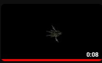

# Project Overview
## Game Concept 
The core concept of our game is to have 6 unique characters battle each other in a 1v1 match. The winner of the match is determind through a Random Number Generator(RNG) and whoever gets the higher number between the 2 players wins the game.

## Core Technology
THe core technology we are using to for this project are RFID readers. What the RFID reader does is that when it detects the RFID card, it sends data related to that unique card to the server to display a specific video.

## Pepperghost Technology
How we achieve pepperghost is through the light emitted from the TV monitor being reflected onto the acrylic sheet, hung at a certain angle. The projected image then interacts with the landscape, by having the projected image walk on the physical landscape.

## **Asset animations** 

<h3>Assasin</h3>

This is how the death animation of the Assasin looks like!

This is how the victory animation of the Assasin looks like!

This is how the spawn animation of the Assasin looks like!

<h3>Lizard</h3>

This is how the death animation of the Lizard looks like!

This is how the victory animation of the Lizard looks like!

This is how the spawn animation of the Lizard looks like!

<h3>Elder</h3>

This is how the death animation of the Elder looks like!

This is how the victory animation of the ELder looks like!

This is how the spawn animation of the ELder looks like!

