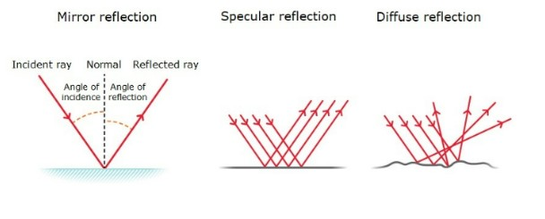

## Specular Reflection Phenomenon

Based on the figure above, the angle of incidence is the angle between the light ray from the source of light and a line perpendicular (the imaginary line is normal) to the denser medium and as such the angle of reflection is symmetrically opposite from the angle of incidence. This was only possible on a smooth and polished surface. [3]

Light travels in a straight line and when it passes through a medium with different opacity, some of them can be absorbed, transmitted, refracted, and reflected  [3] ,[4]In this case for the acrylic sheet which is transparent and has a reflective surface, the majority of the light is transmitted, and some are reflected [4].This is due to the smoothness of the material, so when light encounters a smooth surface, every reflection is perfect at each point, and parallel angles of light are achieved. 
This is known as specular reflection. The light ray from an object gets reflected perfectly, and we can see the image of that object on the smooth surface[5]. 
