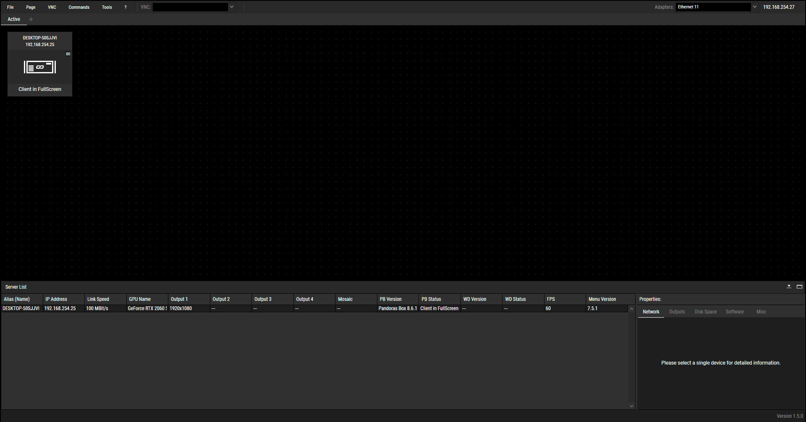
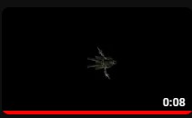
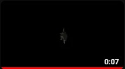

# EGL315-AY23-24

## Software Required: 
Christie Pandora Box 8.6.1  
Christie Pandora Box Server Management 1.5.0 
Widget Designer Unlimited 6.5.6 
GrandMA on PC 1.9.2.2 

## Hardware Required: 
Pandora Box license dongle x 2 
Passive speaker (JBL css 1st) x 2 
Audio Power Amplifier (Kramer 914 100w) 
grandMA3 console(Insert Model Number) x 1 
Laptop (HP ZBook 15 G5) x 1 
TV monitor (Samsung UE46A ) x 1 
RFID reader (Phidget 1023) x 2 
USB hub (ATZ UH3102) x 1 
DMX transmitter (micro f-1 lite G5) x 4 
Media Server(HP Workstation) x1 
Network switch (netgear FS108) x 1 
Acrylic sheet (80x70cm) x 1 
Lanscape board (84x58cm) x 1 
DMX splitter (MDRT DMX512) x 2 
USB type C to female LAN adapter x 2 

## Cables Required: 
HDMI cable x 2 
5-pin female to 5-pin male XLR cable x 6 
3.5mm to 4 bear end cable x 1 
LAN cable x 4 

## Controls Diagram
(Insert Control Diagram here) 
The system has 3 main part: input, process, output, being laptop, server, monitor respectively.The laptop as the processor and the TV monitor as the output. The RFID reader sends input data when it detects the RfiD card, sends it to the laptop to process the data and will output the result on the TV monitor.

## Video Diagram
(Insert Video Diagram here) 
The laptop is connected to the server through the network switch via LAN. It is able to send video to the server due to the softwares Christie Pandora Box and Christie Pandora Box Server Management being connected to each other. THe server then sends video signal to the audio de-embedder via HDMI, the audio de-embedder then seperates the audio and video signal in the HDMI connection and sends only video signal to the TV monitor via HDMI connection. 

## Lighting Diagram
(Insert Lighting Diagram Here) 
THe grandMA3 acts as the input and processing device to control the lights. It sends DMX signal (a type of signal that controls lights) to 2 DMX splitter, which then sends DMX signal to 4 DMX transmitter, 2 per splitter. The DMX transmitter then sends DMX signal to the DMX receiver on the hoist wirelessly, controlling the lights.

## Audio Diagram
(Insert Diagram Here) 
The Laptop sends video and audio signal to the audio de-embedder via HDMI connection. The audio de-embedder then extracts the audio signal and sends it to the amplifier, connected via the 3.5mm jack to terminal block. The amplifier then sends the audio signal to the 2 passive speakers, resulting in audio playing.

## Control Setup (Hardware)
<h3>Step 1: Connect the laptop to USB hub via USB type A - USB type B 3.0</h3>
<h3>Step 2: Connect the RFID readers to USB hub via USB type A - USB type B 2.0</h3>
<h3>Step 3: Connect the phidget to USB hub via USB type A - USB mini</h3>

## Control Setup (Software)
<h3>Step 1: Setting up Widget Designer</h3>
<h3>Step 2:</h3>
<h3>Step 3:</h3>
<h3>Step 4:</h3>

## Video Setup (Hardware)
<h3>Step 1: Connect Laptop to Network Switch via LAN cable</h3>
<h3>Step 2: Connect Nework Switch to Server via LAN cable</h3>
<h3>Step 3: Connect Network Switch to audio de-embedder via HDMI cable</h3>
<h3>Step 4: Connect audio de-embedder to TV monitor via HDMI cable</h3>

## Video Setup (Software)
<h3>Step 1: Setting up Christie Pandora Box</h3>

  
Create a folder to store all the required assets

  
Under ...... ensure your Domain is 1 and your preferred netowrk adaptor is Ethernet 11 

  
Configure the ip address your laptop's Ethernet 11 to 192.168.254.27

  
Add the required amount of video layers under the server(Desktop xxx) as shown in the image below by right-clicking the server -> add device -> add video layer

<h3>Step 2: Setting up Christie Pandora Box Server Management</h3>

  
Ensure that your server is on the same ip subnet, being 192.168.254.25 and select Ethernet 11 under Adaptor options 

<h3>Step 3: Connecting to Christie Pandora Box to Christie Pandora Box Server Management</h3>
After configuring the ip addresses and adaptor connection of both your laptop and server, double check on Christie Pandora Box to see if both softwares are connected

## **Asset animations** 

This is how the death animation of the Assasin looks like!

This is how the victory animation of the Assasin looks like!

This is how the spawn animation of the Assasin looks like!

