# EGL315-AY23-24

## Software Required: 
PB 8.6.1 
PB_Server Management 1.5.0 
WD Unlimited 6.5.6 
GrandMA on PC 1.9.2.2 

## Hardware Required: 
PB license dongle x 2 
Passive speakers (JBL css 1st) x 2 
2Port Node onPC (grandMA3 onPC 2Port Node 2k) x 1 
Laptops (HP ZBook 15 G5) x 2 
TV monitor (Samsung UE46A ) x 1 
RFID reader (Phidget 1023) x 2 
USB hub (ATZ UH3102) x 1 
DMX transmitter (micro f-1 lite G5) x 4 
Media Server(HP Workstation) x1 
Network switch (netgear FS108) x 1 
Acrylic sheet (80x70cm) x 1 
Lanscape board (84x58cm) x 1 
DMX splitter (MDRT DMX512) x 2 
USB type C to female LAN adapter x 2 

## Cables Required: 
HDMI cable x 1 
5-pin female to 5-pin male XLR cable x 6 
3.5mm to 4 bear end cable x 1 
LAN cable x 4 

## Video Setup

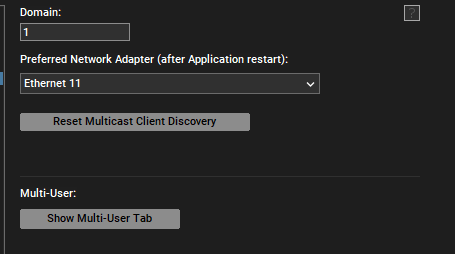
 First, check that the connection of the   
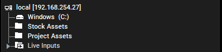
 Search for the folder where all the media files sent from NP students are saved  
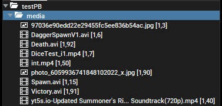
 Once found the folder, create a folder named 'media' in Pandora Box bring all the files into media folder  
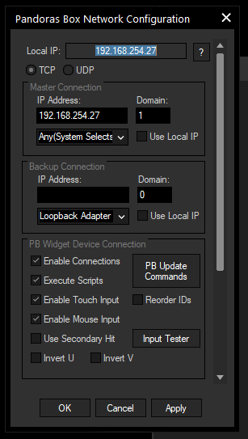
 Input the laptop IP Address to configure correctly for Widget Designer  

 Write down the code when RFID card touches the RFID reader  

 Write down the code when RFID card leaves the RFID reader  
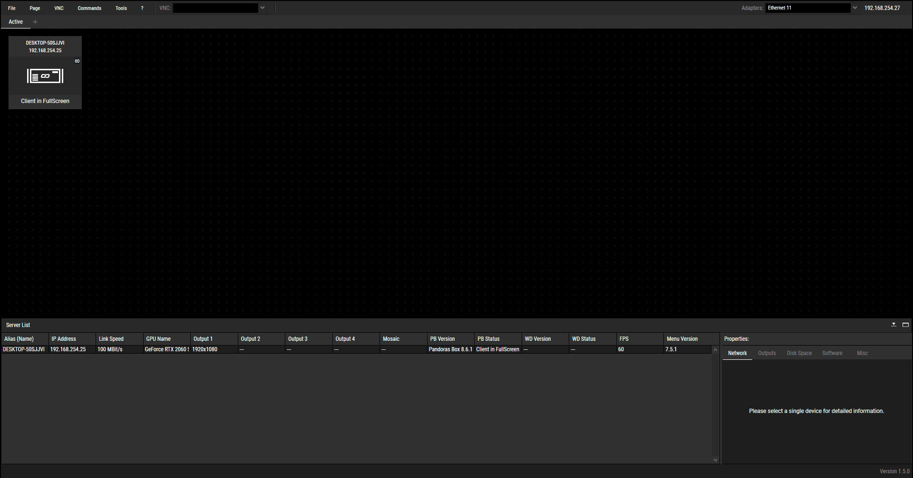
 Turn on the server that is connected to the laptop by LAN, and connect VNC by using Server Management  
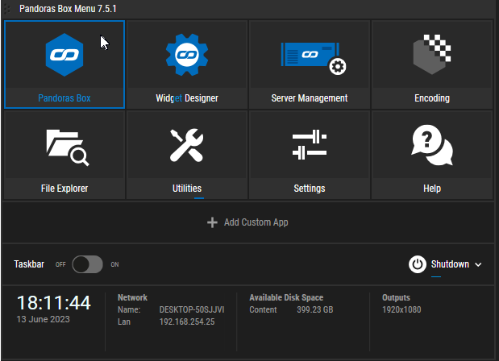
 Press Pandoras Box icon to display the screen from Pandoras Box in laptop to server, and server to TV so it can be projected  
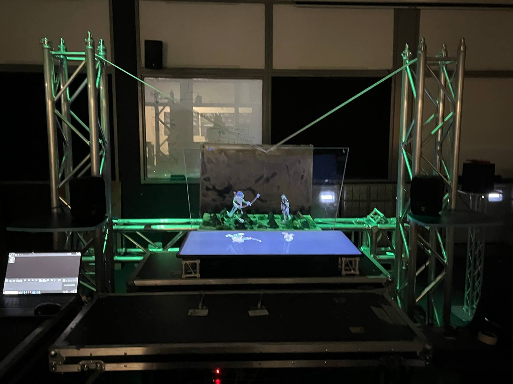
 End result  

## Lighting Setup

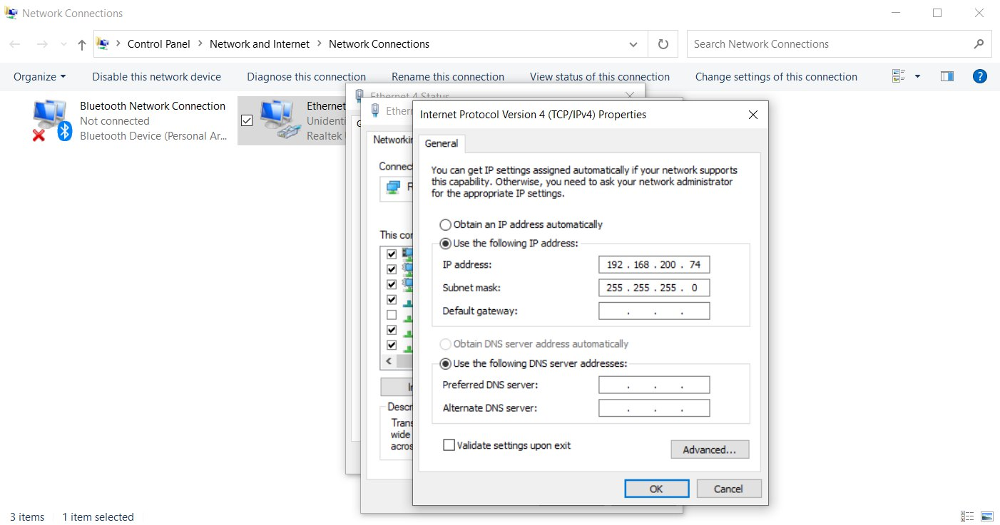

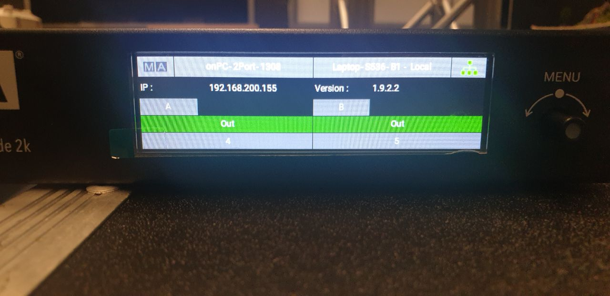
Ensure that the laptop(the one controlling the lights) and the 2 port node is on the same subnet address
 

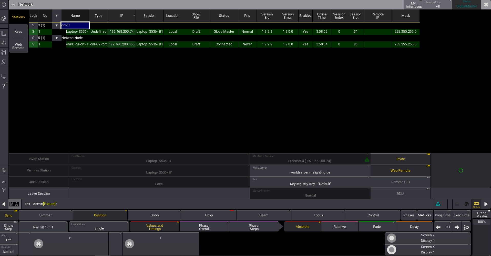
Make sure to your 2 port node on your grandMA3 is highlighted green meaning the 2 port node is connected to grandMA3 on your laptop 
Steps to connect 2port node: 
1)Under MA - Net Interface select your Ethernet port 
2)Select the onPC-2Port-1 box 
3)Click create
4)Click invite station

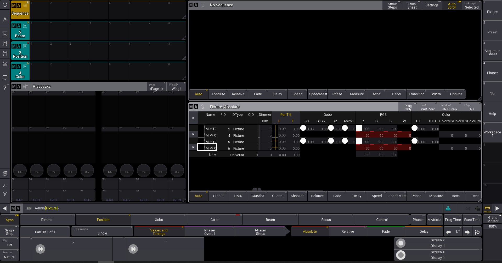
Ensure you are able to see all the essentials windows on your grandMA3 workspace

## Audio Setup

Type this code into your start button under to play music

