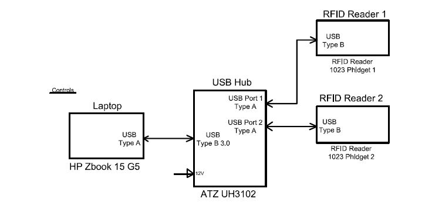

# EGL315-AY23-24


## Software Required:<br>
PB 8.6.1<br>
PB_Server Management 1.5.0<br>
WD Unlimited 6.5.6<br>
GrandMA on PC 1.9.2.2<br>

## Hardware Required:<br>
PB license dongle x 2<br>
Passive speakers (JBL css 1st) x 2<br>
2Port Node onPC (grandMA3 onPC 2Port Node 2k) x 1<br>
Laptops (HP ZBook 15 G5) x 2<br>
TV monitor (Samsung UE46A ) x 1<br>
RFID reader (Phidget 1023) x 2<br>
USB hub (ATZ UH3102) x 1<br>
DMX transmitter (micro f-1 lite G5) x 4<br>
Media Server(HP Workstation) x1<br>
Network switch (netgear FS108) x 1<br>
Acrylic sheet (80x70cm) x 1<br>
Lanscape board (84x58cm) x 1<br>
DMX splitter (MDRT DMX512) x 2<br>
USB type C to female LAN adapter x 2<br>

## Cables Required:<br>
HDMI cable x 1<br>
5-pin female to 5-pin male XLR cable x 6<br>
3.5mm to 4 bear end cable x 1<br>
LAN cable x 4<br>

## Video & Control Setup<hr>





<br>First, check that the connection of the <br><br>

<br>Search for the folder where all the media files sent from NP students are saved<br><br>

<br>Once found the folder, create a folder named 'media' in Pandora Box bring all the files into media folder<br><br>

<br>Input the laptop IP Address to configure correctly for Widget Designer<br><br>

<br>Write down the code when RFID card touches the RFID
reader<br><br>
```
var cardString1 = "" 
cardString1 = Phidgets_PhidgetRFID5.TagString 
If cardString1.IsMatch("010775a7cc") { 
 DeviceSetParam(3,1,"Opacity",0) DeviceSetParam(3,2,"X Pos",4) 
 DeviceSetParam(3,2,"Y Pos",-3) DeviceSetParam(3,2,"Z Pos",2) 
 DeviceSetParam(3,2,"Z Scale",0.660) DeviceSetParam(3,2,"Y Scale",0.660) 
 DeviceSetParam(3,2,"X Scale",0.660) DeviceSetParam(3,2,"RGB Key|Mix",255) 
 WDWait(0.5) DeviceSetParam(3,2,"Opacity",255) 
 DeviceSetParam(3,3,"Opacity",0) DeviceSetParam(3,4,"Opacity",0) 
 DeviceSetParam(3,5,"Opacity",0) DeviceSetMedia(3,2,1,15) 
 DeviceSetParam(3,2,"Playback Transport","Play")  WDWait(5.0) 
 DeviceSetParam(3,2,"Playback Transport","Pause")  DeviceSetParam(3,3,"Playback Transport","Stop") 
 DeviceSetParam(3,4,"Playback Transport","Stop")   DeviceSetParam(3,5,"Playback Transport","Stop") 
 PhidgetRFID5IsReady = True 
 playRollDiceVideo() 
} 
Elseif cardString1.IsMatch("010775a07a") { 
 DeviceSetParam(3,1,"Opacity",0) DeviceSetParam(3,3,"X Pos",2) 
 DeviceSetParam(3,3,"Z Scale",0.750) DeviceSetParam(3,3,"Y Scale",0.750) 
 DeviceSetParam(3,3,"X Scale",0.750) DeviceSetParam(3,3,"RGB Key|Mix",255) 
 WDWait(0.5) DeviceSetParam(3,2,"Opacity",0) 
 DeviceSetParam(3,3,"Opacity",255) DeviceSetParam(3,4,"Opacity",0) 
 DeviceSetParam(3,5,"Opacity",0) DeviceSetMedia(3,3,1,9) 
 DeviceSetParam(3,3,"Playback Transport","Play")  WDWait(5.0) 
 DeviceSetParam(3,3,"Playback Transport","Pause")  DeviceSetParam(3,2,"Playback Transport","Stop")  
 DeviceSetParam(3,4,"Playback Transport","Stop")  DeviceSetParam(3,5,"Playback Transport","Stop")  
} 
 
Elseif cardString1.IsMatch("01077575bb") { DeviceSetParam(3,1,"Opacity",0) 
 DeviceSetParam(3,4,"X Pos",2) DeviceSetParam(3,4,"Z Scale",0.750) 
 DeviceSetParam(3,4,"Y Scale",0.750) DeviceSetParam(3,4,"X Scale",0.750) 
 DeviceSetParam(3,4,"RGB Key|Mix",255) WDWait(0.5) 
 DeviceSetParam(3,2,"Opacity",0) DeviceSetParam(3,3,"Opacity",0) 
 DeviceSetParam(3,4,"Opacity",255) DeviceSetParam(3,5,"Opacity",0) 
 DeviceSetMedia(3,4,1,6) DeviceSetParam(3,4,"Playback Transport","Play")  
 WDWait(5.0) DeviceSetParam(3,4,"Playback Transport","Pause")  
 DeviceSetParam(3,2,"Playback Transport","Stop")  DeviceSetParam(3,3,"Playback Transport","Stop")  
 DeviceSetParam(3,5,"Playback Transport","Stop") } 
Elseif cardString1.IsMatch("01077584cd") { 
 DeviceSetParam(3,1,"Opacity",0) DeviceSetParam(3,5,"X Pos",2) 
 DeviceSetParam(3,5,"Z Scale",0.750) DeviceSetParam(3,5,"Y Scale",0.750) 
 DeviceSetParam(3,5,"X Scale",0.750) DeviceSetParam(3,5,"RGB Key|Mix",255) 
 WDWait(0.5) DeviceSetParam(3,2,"Opacity",0) 
 DeviceSetParam(3,3,"Opacity",0) DeviceSetParam(3,4,"Opacity",0) 
 DeviceSetParam(3,5,"Opacity",255) DeviceSetMedia(3,5,1,10) 
 DeviceSetParam(3,5,"Playback Transport","Play")  WDWait(5.0) 
 DeviceSetParam(3,5,"Playback Transport","Pause")  DeviceSetParam(3,2,"Playback Transport","Stop")  
 DeviceSetParam(3,3,"Playback Transport","Stop")  DeviceSetParam(3,4,"Playback Transport","Stop")  
}
```

<br>Write down the code when RFID card leaves the RFID reader<br><br>
```
ResetDevice(3,2)ResetDevice(3,3)
ResetDevice(3,4)ResetDevice(3,5)
ResetDevice(3,29)ResetDevice(3,30)
PhidgetRFID2IsReady = falsePhidgetRFID5IsReady = false
```
Code for Dice Roll
```
if PhidgetRFID2IsReady = true AND PhidgetRFID5IsReady=true { DeviceSetParam(3,29,"RGB Key|Mix",255)
 DeviceSetParam(3,30,"RGB Key|Mix",255) DeviceSetParam(3,29,"X Pos",-4)
 DeviceSetParam(3,30,"X Pos",4.9) DeviceSetParam(3,29,"Y Pos",0)
 DeviceSetParam(3,30,"Y Pos",0) DeviceSetParam(3,29,"Y Angle",180)
 DeviceSetParam(3,30,"Y Angle",180) DeviceSetParam(3,29,"Z Scale",0.490)
 DeviceSetParam(3,30,"Z Scale",0.490) DeviceSetParam(3,30,"Y Scale",0.490)
 DeviceSetParam(3,29,"Y Scale",0.490) DeviceSetParam(3,29,"X Scale",0.490)
 DeviceSetParam(3,30,"X Scale",0.490) WDWait(0.2)
 DeviceSetMedia(3,29,1,7) DeviceSetMedia(3,30,1,7)
 DeviceSetParam(3,29,"Playback Transport","Play") DeviceSetParam(3,30,"Playback Transport","Play")  
 WDWait(3.0) DeviceSetParam(3,29,"Playback Transport","Pause") 
 DeviceSetParam(3,30,"Playback Transport","Pause")  

}
```


<br>Turn on the server that is connected to the laptop by LAN, and connect VNC by using Server Management<br><br>

<br>Press Pandoras Box icon to display the screen from Pandoras Box in laptop to server, and server to TV so it can be projected<br><br>

<br>End result<br><br>

## Lighting Setup<hr>


Ensure that the laptop(the one controlling the lights) and the 2 port node is on the same subnet address
<br>


Make sure to your 2 port node on your grandMA3 is highlighted green meaning the 2 port node is connected to grandMA3 on your laptop<br>
Steps to connect 2port node:<br>
1)Under MA - Net Interface select your Ethernet port 
2)Select the onPC-2Port-1 box 
3)Click create
4)Click invite station


Ensure you are able to see all the essentials windows on your grandMA3 workspace

## Audio Setup<hr>

Type this code into your start button under to play music

## **Background Music** 

[](https://www.youtube.com/watch?v=iy6YDd5iHB4)

This is summoner rift theme references from League of legends and is played before the fightingphase of our two player game

## **Background** 


## **Dagger Edits** 

[](https://www.youtube.com/watch?v=DiMfWIs8LUc) 

A short attacking animation video of daggerman 

[](https://youtu.be/xPTUq8ydhzo)

A full death animation video of daggerman 

[](https://youtu.be/zA-caRkYX9w)

A full victory animation video of daggerman 

[](https://youtu.be/shDJ2hvP4XM)

A death animation video of daggerman 

[](https://youtu.be/bo7_ZhQ19j4)

An idle animation video of daggerman  

[](https://youtu.be/eGG7mUD-HII)

A spawn animation video of daggerman

[](https://youtu.be/eLfmyesCC1E)

A walking animation video of daggerman


