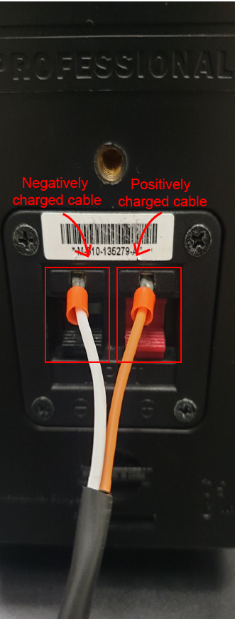

# EGL315-AY23-24

## Software Required: 
Christie Pandora Box 8.6.1  
Christie Pandora Box Server Management 1.5.0 
Widget Designer Unlimited 6.5.6 
GrandMA on PC 1.9.2.2 

## Hardware Required: 
Pandora Box license dongle x 2 
Passive speaker (JBL css 1st) x 2 
Audio Power Amplifier (Kramer 914 100w) 
grandMA3 console(Insert Model Number) x 1 
Laptop (HP ZBook 15 G5) x 1 
TV monitor (Samsung UE46A ) x 1 
RFID reader (Phidget 1023) x 2 
USB hub (ATZ UH3102) x 1 
DMX transmitter (micro f-1 lite G5) x 4 
Media Server(HP Workstation) x1 
Network switch (netgear FS108) x 1 
Acrylic sheet (80x70cm) x 1 
Lanscape board (84x58cm) x 1 
DMX splitter (MDRT DMX512) x 2 
USB type C to female LAN adapter x 2 

## Cables Required: 
HDMI cable x 2 
5-pin female to 5-pin male XLR cable x 6 
3.5mm to 4 bear end cable x 1 
LAN cable x 4 

## Controls Setup
The system has 3 main part: input, process, output, being laptop, server, monitor respectively.The laptop as the processor and the TV monitor as the output. The RFID reader sends input data when it detects the RfiD card, sends it to the laptop to process the data and will output the result on the TV monitor.

## Video Setup
The laptop is connected to the server through the network switch via LAN. It is able to send video to the server due to the softwares Christie Pandora Box and Christie Pandora Box Server Management being connected to each other. THe server then sends video signal to the audio de-embedder via HDMI, the audio de-embedder then seperates the audio and video signal in the HDMI connection and sends only video signal to the TV monitor via HDMI connection. 

## Lighting Setup
THe grandMA3 acts as the input and processing device to control the lights. It sends DMX signal (a type of signal that controls lights) to 2 DMX splitter, which then sends DMX signal to 4 DMX transmitter, 2 per splitter. The DMX transmitter then sends DMX signal to the DMX receiver on the hoist wirelessly, controlling the lights.

## Audio Setup
The Laptop sends video and audio signal to the audio de-embedder via HDMI connection. The audio de-embedder then extracts the audio signal and sends it to the amplifier, connected via the 3.5mm jack to terminal block. The amplifier then sends the audio signal to the 2 passive speakers, resulting in audio playing.

## Control Setup (Hardware)
<h3>Step 1: Connect the laptop to USB hub via USB type A - USB type B 3.0</h3>

This allows the laptop to connect to more devices via usb

<h3>Step 2: Connect the RFID readers to USB hub via USB type A - USB type B 2.0</h3>

This allows the laptop to receive information from the RFID readers

<h3>Step 3: Connect the phidget to USB hub via USB type A - USB mini</h3>

This allows the laptop to receive information from phidget 

## Control Setup (Software)
<h3>Step 1: Setting up Widget Designer</h3>

 
Go to Connection -> PB Configuation, ensure your domain is 1 and your ip address set in Widget Designer is 192.168.254.27 and your domain is 1 to connect to Pandora Box

<h3>Step 2: Configuring Widget Designer</h3>

To add the devices required into Widget Designer, go to Devices -> Configuration then click the plus sign on the bottom left of the tab and select the required device: Interface Kit 8/8/8 x1, PhidgetRFID x2 

To code the devices required into Widget Designer, go to Devices -> Configuration then click the plus sign on the bottom left of the tab and select Event Listener, do this 4 times 

<h3>Step 3: Coding the devices added</h3>

Copy the code provided into each device. RFID1_Code for RFID 1 tag enter, RFID2_Code and WinnerOutcome for RFID 2 tag enter and Button for Phidget 8/8/8

<h3>Step 4: Add the required functions</h3>

 
To create functions go to scripting -> Scripts (Functions and Macros) -> New Function. Do this 4 times, then copy and paste the function codes under System codes -> Functions, each code for each function

## Video Setup (Hardware)
<h3>Step 1: Connect Laptop to Network Switch via LAN cable</h3>
Use the type-c male to LAN female adapter to connect the LAN from the laptop to Network. This allows the laptop to talk to any devices connected to the Network Switch

<h3>Step 2: Connect Nework Switch to Server via LAN cable</h3>
This allows the server to talk to any devices connected to the Network Switch

<h3>Step 3: Connect Server to audio de-embedder via HDMI cable</h3>

 
Connect the HDMI cable from the server to the audio de-embedder, this sends Audio and Video signal from the server to the audio de-embedder 

<h3>Step 4: Connect audio de-embedder to TV monitor via HDMI cable</h3>

 
This sends video ONLY signal to the TV monitor

## Video Setup (Software)
<h3>Step 1: Setting up Christie Pandora Box</h3>

 
Create a folder to store all the required assets

 
Under Configuration -> Network, ensure your Domain is 1 and your preferred netowrk adaptor is Ethernet 11 

 
Configure the ip address your laptop's Ethernet 11 to 192.168.254.27

 
Add the required amount of video layers under the server(Desktop xxx) as shown in the image below by right-clicking the server -> add device -> add video layer

<h3>Step 2: Setting up Christie Pandora Box Server Management</h3>

 
Ensure that your server is on the same ip subnet, being 192.168.254.25 and select Ethernet 11 under Adaptor options 

<h3>Step 3: Connecting to Christie Pandora Box to Christie Pandora Box Server Management</h3>
After configuring the ip addresses and adaptor connection of both your laptop and server, double check on Christie Pandora Box to see if both softwares are connected.

## Audio Setup (Hardware)
<h3>Step 1: Connect 3.5mm jack to Audio De-embedder</h3>

 
Using the custom speaker cable provided connect the end with the 3.5mm jack to the audio de-embedder.

<h3>Step 2: Connect bear end cable to Speakers</h3>

 
Using the same custom speaker cable connect the bear end part of the cable to the speakers, each speaker should have a positvely and a negatively charged wire connected to it.

## Audio Setup (Software)
<h3>Setting up audio in Christie Pandora Box</h3>
Insert the audio file provided in to the timeline at ....Then, under open up the layer the audio file is in, in the audio section  change the value to -96dB for the start of the audio clip, click Store Active(red button at the top of timeline), click your cursor to a later part of the clip and store active the audio at 0dB. This gives the audio a fade in effect.

## Lighting Setup (Hardware)
<h3>Step 1: Connecting grandMA3 console to DMX Splitters</h3>

 
Using the 5-pin xlr cable connect the male side of the cable into port A of the console, Do the same for port B.

 
On the other end of the same cable that you used to connect to the console, connect it to the DMX input port of the DMX splitter connect the other cable that was plugged into port B into another DMX splitter.

<h3>Step 2: Connecting DMX Transmitters to DMX Splitters</h3>

 
Connect the DMX Transmitter into the DMX output ports of the DMX splitter, each splitter should be connected to 2 DMX Transmitters

## Lighting Setup (Software)
<h3>Step 1: Import the MVP_File.show</h3>

 
The show file provided will give a template on how the lights are being controlled

<h3>Step 2: Creating Sequences</h3>
Create 4 sequences for intro, battle, player 1 win and player 2 win. You can do so by typing store and clicking on an empty box in the Sequence window

<h3>Step 3: Creating cues</h3>
These cues will trigger which lights will activate in which Sequence you create the cue in, 

## Demo Video (Minimum Viable Product)

Here is a [link][MVP_url] to YouTube for you to see how our project looks like.

[MVP_url]:https://www.youtube.com/watch?v=gwVx0OAnEbk

## Final Product

This is an outlook of our how Final Setup 
Here is a [link](https://youtu.be/4WmhNmc1prY) to YouTube to our presentation of the setup and this [link](https://youtu.be/wx2ngAvR0xs) on our gameplay demonstration.

We added 2 more buttons, green and yellow based from the MVP for users to hit reptitively as quickly
as they can, this is another scoring system that whoever hits the most time score more points than the other

## How to play

### Step 1:
Press on the red button ot start the instuctional clip which will illustrate on what the 
user needs to know the and game build up before playing.

### Step 2:
There are two sets of cards, one for player **1** and **2**. Both players will be seated and they will have to pick the unique characters(Lizard: player 1 or Humannoid: player 2) and **place** it on the **RFID reader**. This will trigger a respond from our **Christie Pandora box** software system to **summon** the designated characters of the cards

To view the script which is responsible for the summoning of characters, you can go to `RFID1_Code.txt` located under the `System Codes/Event Listeners` folder

### Step 3:
All you have to do is watch, as two dice drop and rolls. This is a scoring system whereby 
when the dice rolls with a larger number compared to the other,that player will get the higher 
score.

However it's does not end there as to determine the winner of that round. There will be a next phase which both players have to press the two big buttons in this case would be green and yellow for player 1 and 2 respectively. The adrenaline part of this is that whoever can press the quickest will add more points to their initial one from the dice roll. Player with the higher points at the end will win that round! Before they do that there will be a 5 second coutdown for them to get ready.

