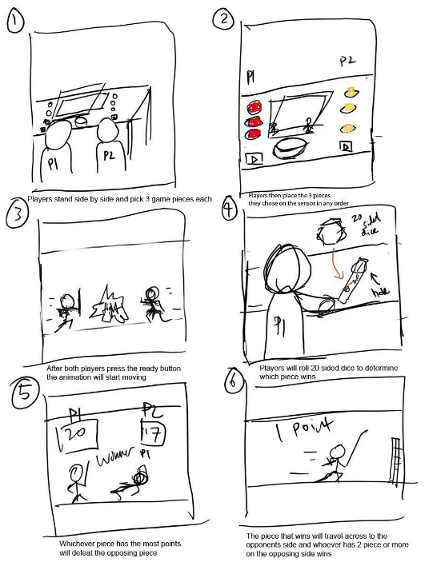

# EGL315-AY23/24
## **Storyboard**

## **Targeted Age Group**
The targeted age group of our project are teenagers 13 to 24 since they are familiar with playing games and have more exposure to such games. Students at that age have been taught the concept of probability in their level of education in school which is one of the elements that the games contain [1]

## **What does your group hope to convey to users visiting your exhibit system?**
Our group hopes to promote a more immersive way to experience playing board games with the usage of the pepper ghost effect while at the same time providing the audience with further insight and knowledge about the concept of Pepper’s Ghosts.

## **How would you envision your system to convey the unique learning points to your users when interacting with the exhibit system?**

The theme of the game we are exhibiting through holographic technology is D&D chess. The sensors will provide an interaction with the user, as they place the pieces on it to summon the holographic image of the D&D characters. There will be faceless twenty-sided dice for them to throw for interactive gameplay. Afterwards, there will be 3D animation of them fighting with sound effects produced by the speaker enhancing the immersive experience. Even though it is a typical multiplayer game our goal is to have them experience the game as immersive as possible. We also want to teach our audience the concept of probability by rolling the 20-sided dice in the game. Our approach to teaching is through thematic learning, which is learning through an instructional guide, in this case, our game. Thematic learning has been proven to be effective for teenagers, as stated in an article “Several studies have examined the impact of playing games to develop managerial skills (Corsi et al., 2006, Kretschmann, 2012). Games that are developed to achieve attitudinal change are sometimes used by governments and NGOs to raise awareness about a certain topic, such as poverty (Neys, Van Looy, De grove, & Jansz, 2012)[2]. 

## **Literature Review**

### <u>Introduction</u>
John H. Pepper, who was lecturing at the Royal Polytechnic Institute in London at the time, came up with an easy way to implement Dirck’s effect in existing theatres using just a sheet of glass. Since Pepper popularised the illusion, it became known as Pepper’s ghost. Pepper started showing the illusion at theatres around England and Australia, puzzling audiences. One local newspaper even reported that accomplished physicist Michael Faraday returned to Pepper after seeing the illusion and demanded an explanation.
The pepper ghost technique is an illusion which is achieved using a transparent medium like an acrylic sheet, placed at a certain angle between a hidden room and the audience.
Specular reflection is the reason behind the pepper's ghost, it's achieved when the angle of incidence of the light ray is travelling to a smooth and polished surface and it gets reflected into our eyes.
## Pepper Ghost 

The original Pepper’s Ghost optical illusion involves placing a large piece of glass at an angle between a brightly lit “stage” room into which viewers look straight ahead and a hidden room. The glass reflects the hidden room, kept dark, that holds a “ghostly” scene. When the lights in the hidden room are slightly raised to illuminate the scene, the lights in the stage room are slightly dimmed, and the apparition appears to the audience.   
## Specular Reflection Phenomenon

Based on the figure above, the angle of incidence is the angle between the light ray from the source of light and a line perpendicular (the imaginary line is normal) to the denser medium and as such the angle of reflection is symmetrically opposite from the angle of incidence. This was only possible on a smooth and polished surface. [3]

Light travels in a straight line and when it passes through a medium with different opacity, some of them can be absorbed, transmitted, refracted, and reflected  [3] ,[4]In this case for the acrylic sheet which is transparent and has a reflective surface, the majority of the light is transmitted, and some are reflected [4].This is due to the smoothness of the material, so when light encounters a smooth surface, every reflection is perfect at each point, and parallel angles of light are achieved. 
This is known as specular reflection. The light ray from an object gets reflected perfectly, and we can see the image of that object on the smooth surface[5].

### **What are the conditions of Specular reflection?**
The following are the two conditions:

* The degree of smoothness and polish of the medium
* The medium must have a flat surface

The **smoother** and more **polished** the surface of an object, the **greater light** it reflects. The greater the light an object reflects, the **clearer** the image of another object appears on its surface. For instance, stainless steel plates and spoons can show the image of an object placed in front of them as they are able to reflect a considerable amount of light that falls on their surface. A well-polished surface of a tabletop can also produce an image, as well-polished surfaces reflect more light as compared to unpolished ones [4]

### **Conclusion:**  
The original Pepper’s Ghost optical illusion involves placing a large piece of glass at an angle between a brightly lit “stage” room into which viewers look straight ahead and a hidden room. The glass reflects the hidden dark room that holds a “ghostly” scene. When the lights in the hidden room are slightly raised to illuminate the scene, the lights in the stage room are slightly dimmed, and the apparition appears to the audience.

## **Identify the core technologies/concepts that the group will be leveraging for the project.**

Our group will be mainly leveraging Pepper's ghost. Pepper Ghost mainly uses the light theory, specular reflection happening inside the acrylic to produce a holographic-like image.  Core technologies used would be the projector for screen projection, and RFID readers to detect the unique RFID tokens that will be used for the 6 unique game pieces. The reason we used RFID is because the RFID sensor can detect the individual values allowing us to use the game pieces as tokens with each token having a unique ID. 
Other key technologies used would be the passive speakers in the audio aspect, and the intelligent lights in the lighting aspect. For audio, we are using the Mackie CR4 for audio purposes, which features a 4-inch woofer and a 0.75-inch ferrofluid-cooled silk dome tweeter. The speaker includes polypropylene woofers and rear-firing ports, ensuring a tight bass response. It can deliver a balanced and clear sound across a frequency response range of 60Hz to 20kHz, with a maximum SPL of 100dB. The Mackie CR4 is crafted to studio quality build standards, guaranteeing top-notch performance.  We also use the wash lights, MiniPanel-FX, to illuminate the game board, to allow both players to identify the board more easily from the virtual aspects and make it appear more prominent. We also use the spotlights, Mistral-TC, to highlight both players playing the game. In conclusion, both lighting and audio technologies used are key to enhancing the user’s experience while playing.   

 

## **Are there Commercial off-the-shelf (COTS) solutions available?**
  * **What is the value of the product?**

    Based on Figure 2 Augmented Reality, Augmented reality superimposes sounds, videos, and graphics onto an existing environment. It uses four main components to superimpose images on current environments: cameras and sensors, processing, projection, and reflection.
    Each of these components provides an individual function. For example, cameras and sensors can detect an image’s depth or calculate the distance between two objects before superimposing digital content atop the user’s view. Projection and reflection add virtual information over what a user sees; for example, a method known as projection mapping enables AR apps to digitally overlay video onto any physical surface.
    * Pros

        * Enhanced experience as everything is in 3D providing depth [6]. 
        * Accessible through smartphones, simplicity in using to create AR [7].
        * Incorporates in the classroom, and aids in teaching a concept of a subject [7].
        * Increase the level of engagement for students[7].
    * Cons
        * This immersive experience is limited to using a handheld device while using Pepper’s ghost illusion technique allows the user to see and have a more 3D feel.
## **Are there similar technologies that can be considered to achieve similar effects? How do your original proposed technologies/concepts be the most suitable for a given application?**

**Projection mapping** can achieve similar results however it can be tough to adjust and for this specific instance of wanting to achieve a 3d like image, it disables us to do that as it will only project out a 2d image onto a surface which is not what we want. However, Pepper’s Ghost utilises reflections to appear as if the real-world object is interacting with the virtual asset, therefore, giving a more immersive illusion for the audience. 

