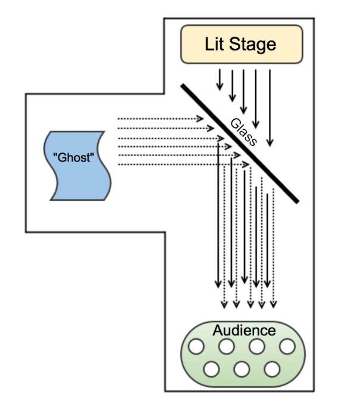

# EGL315-AY23/24
## Core Concept 
Our concept is based on the game Auto Chess where players place characters on a grid-shaped battlefield during a preparation phase, who then fight the opposing team's characters without any further direct input from the player.However the twist in our project would be the animated models will be holographic on the playfield.

**Inspirations**
```
```

**Idea**

## Secondary Concept
Holographic projection of each character with their background information on the side

## Pepper Ghost effect
The original Pepper’s Ghost optical illusion involves placing a large piece of glass at an angle between a brightly lit “stage” room into which viewers look straight ahead and a hidden room. The glass reflects the hidden room, kept dark, that holds a “ghostly” scene. When the lights in the hidden room are slightly raised to illuminate the scene, the lights in the stage room are slightly dimmed, and the apparition appears to the audience.
```
```


Achieving it with the use of acrylic/plexi glass has to be angled at 45 degree to have and 90 degree incident ray to reflection ray
