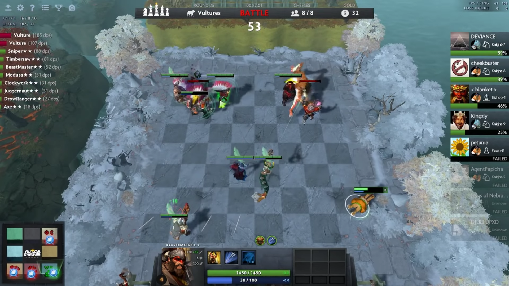
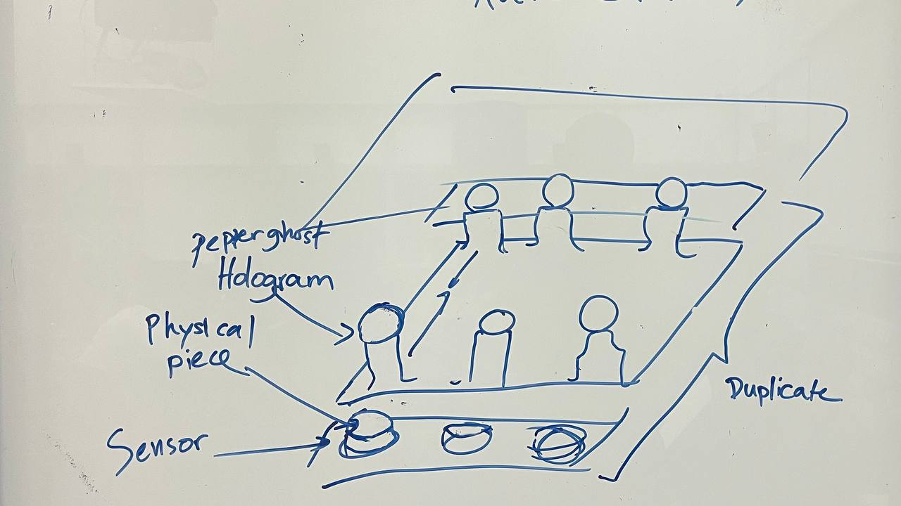
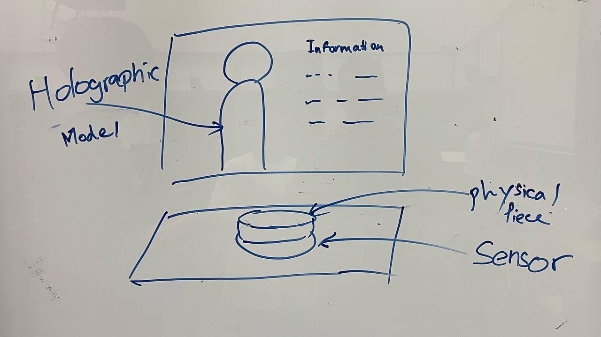

# EGL315-AY23/24
## Core Concept 
Our concept is based on the game Auto Chess where players place characters on a grid-shaped battlefield during a preparation phase, who then fight the opposing team's characters without any further direct input from the player.However the twist in our project would be the animated models will be holographic on the playfield.

**Inspirations**
```
```

**Idea**

## Secondary Concept
Holographic projection of each character with their background information on the side

