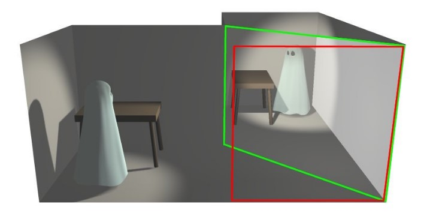

## Pepper Ghost 
The original Pepper’s Ghost optical illusion involves placing a large piece of glass at an angle between a brightly lit “stage” room into which viewers look straight ahead and a hidden room. The glass reflects the hidden room, kept dark, that holds a “ghostly” scene. When the lights in the hidden room are slightly raised to illuminate the scene, the lights in the stage room are slightly dimmed, and the apparition appears to the audience.

## Total internal reflection
